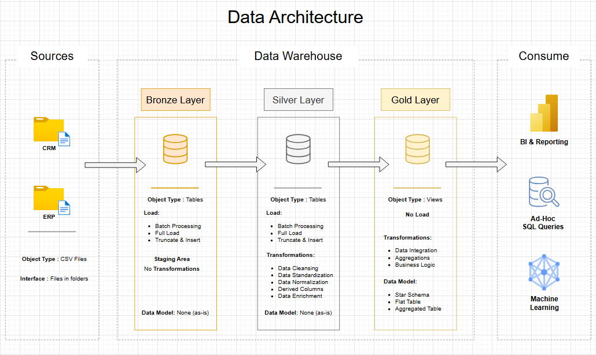

# SQL Data Warehousing & Analytics Project

🚀 **Data Warehouse & Analytics Project**

This project shows how to build a complete data solution from start to finish. It covers the full process: designing a data warehouse, loading data into it, and using it for analysis. The project follows modern data engineering standards.

---

## 🏗️ Data Architecture

This project uses the **Medallion Architecture** approach with three layers: **Bronze**, **Silver**, and **Gold**.



### 1. Bronze Layer
Stores raw data exactly as it comes from the source systems. (Staging Area)  
Data is loaded from CSV files into a SQL Server database without any transformation.

### 2. Silver Layer
Cleans and prepares the data.  
This includes fixing errors, data cleansing, standardizing formats, and organizing the data to make it ready for analysis.

### 3. Gold Layer
Contains business-ready data.  
The data is structured using a star schema (fact and dimension tables) to support reporting and analytics.

---

## 📖 Project Overview

This project includes:

1. **Data Architecture**  
   Designing a modern data warehouse using the Medallion Architecture (Bronze, Silver, Gold).

2. **ETL Pipelines**  
   Extracting, transforming, and loading data from source systems into the warehouse.

3. **Data Modeling**  
   Creating fact and dimension tables optimized for analytical queries.

4. **Analytics & Reporting**  
   Writing SQL queries to generate reports and insights for decision-making.

🎯 This project is useful for professionals and students who want to demonstrate skills in:

- SQL Development  
- Data Architecture  
- Data Engineering  
- ETL Development  
- Data Modeling  
- Data Analytics  

---

## 🛠️ Important Links & Tools

Everything used in this project is free:

- **[Datasets](datasets/):** CSV files used in the project (ERP and CRM data).
- **[SQL Server Express](https://www.microsoft.com/en-us/sql-server/sql-server-downloads):** Free database server to host your SQL database.
- **[SQL Server Management Studio (SSMS)](https://learn.microsoft.com/en-us/sql/ssms/download-sql-server-management-studio-ssms?view=sql-server-ver16):** Tool for managing and working with SQL Server.
- **[Git Repository](https://github.com/):** Use GitHub to manage versions and collaborate on your code.
- **[DrawIO](https://www.drawio.com/):** Create diagrams for architecture, data models, and flows.
- **[Notion](https://www.notion.com/):** Tool for organizing and managing the project.

---

## 🚀 Project Requirements

### Building the Data Warehouse (Data Engineering)

#### Objective
Build a modern data warehouse using SQL Server that combines sales data and supports reporting and business decisions.

#### Specifications

- **Data Sources:** Import data from two systems (ERP and CRM) provided as CSV files.
- **Data Quality:** Clean and fix data issues before analysis.
- **Integration:** Merge both data sources into one clear and user-friendly data model.
- **Scope:** Work only with the most recent dataset. Historical tracking is not required.
- **Documentation:** Clearly document the data model for business and analytics teams.

---

### BI: Analytics & Reporting (Data Analysis)

#### Objective
Create SQL-based analysis to provide insights into:

- **Customer Behavior**
- **Product Performance**
- **Sales Trends**

The goal is to deliver useful business metrics that help stakeholders make better decisions.

---

## 📂 Repository Structure


```
data-warehouse-project/
│
├── datasets/                           # Raw datasets used for the project (ERP and CRM data)
│
├── docs/                               # Project documentation and architecture details
│   ├── data_architecture.png        # Draw.io file shows the project's architecture
│   ├── data_catalog.md                 # Catalog of datasets, including field descriptions and metadata
│   ├── data_flow.png                # Draw.io file for the data flow diagram
│   ├── data_model.png              # Draw.io file for data models (star schema)
│   ├── naming-conventions.md           # Consistent naming guidelines for tables, columns, and files
│
├── scripts/                            # SQL scripts for ETL and transformations
│   ├── bronze/                         # Scripts for extracting and loading raw data
│   ├── silver/                         # Scripts for cleaning and transforming data
│   ├── gold/                           # Scripts for creating analytical models
│
├── tests/                              # Test scripts and quality files
│
├── README.md                           # Project overview and instructions
├── LICENSE                             # License information for the repository
├── .gitignore                          # Files and directories to be ignored by Git
└── requirements.txt                    # Dependencies and requirements for the project
```
---


---

## 🛡️ License

This project is licensed under the [MIT License](LICENSE).  
You are free to use, modify, and share it with proper attribution.

---

## 🌟 About Me

Hi, I’m **Youssef BEN ABDALLAH**, an entry-level Data Analyst passionate about turning raw data into meaningful insights.

I build projects to improve my skills and share practical data solutions.

Let’s connect:

[](https://www.linkedin.com/in/youssefbena/)
