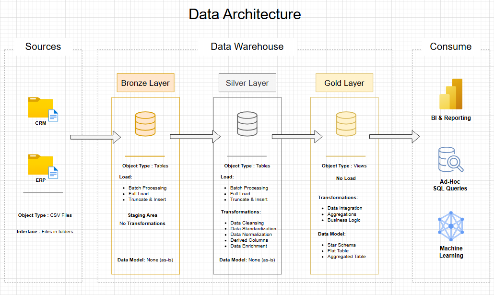
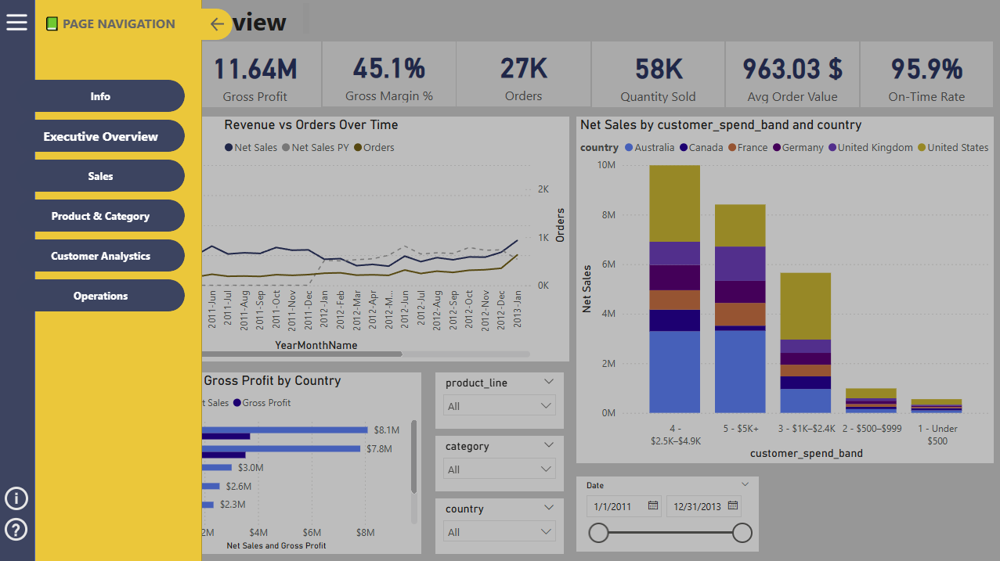
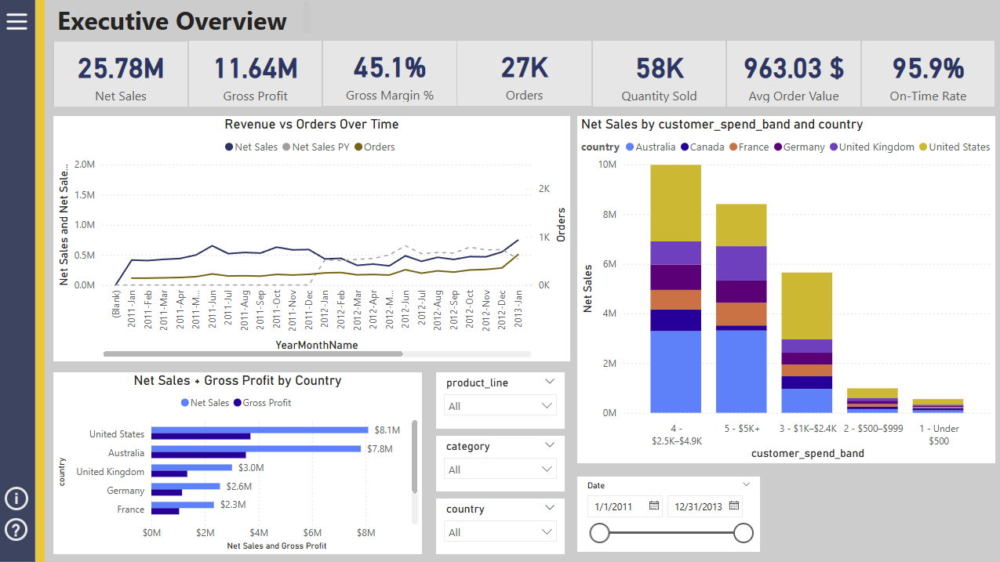
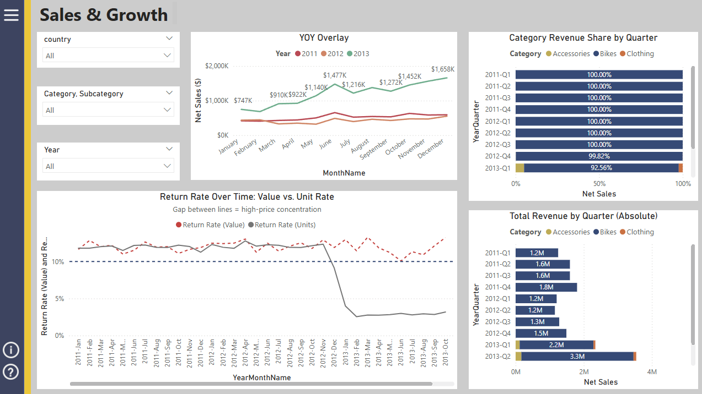
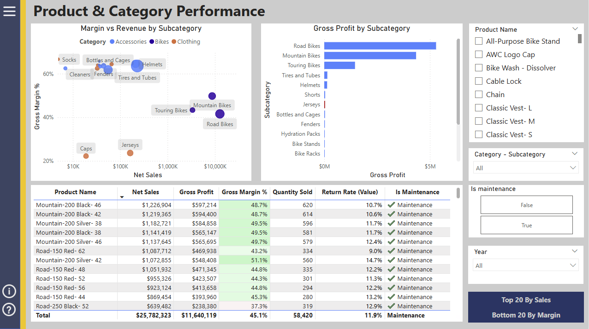
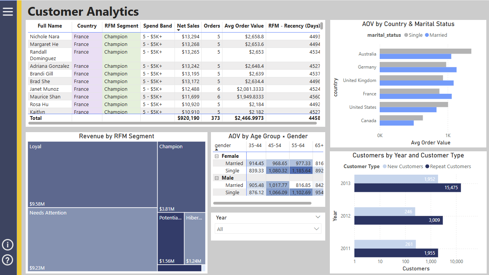
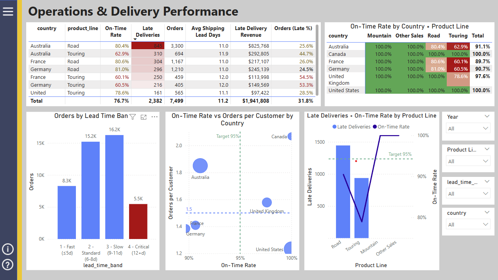

# CRM + ERP Sales Analytics Dashboard

🚀 **Data Warehouse & Analytics Project**

A complete end-to-end data project — from raw source files to a multi-page Power BI dashboard — built on AdventureWorks sales data covering 2011–2013.

The project follows the Medallion Architecture (Bronze → Silver → Gold) to build a clean, analysis-ready data warehouse in SQL Server, then connects it to a 30+ measure Power BI semantic model and a 5-page interactive dashboard.

---

## 📋 Table of Contents

- [Project Background](#project-background)
- [Business Objectives](#business-objectives)
- [Data Architecture](#data-architecture)
- [Data Sources](#data-sources)
- [Data Preparation & Modeling](#data-preparation--modeling)
- [Semantic Model](#semantic-model)
- [Dashboard Pages](#dashboard-pages)
- [Key Insights](#key-insights)
- [Tools & Technologies](#tools--technologies)
- [Repository Structure](#repository-structure)
- [About Me](#about-me)

---

## Project Background

This project simulates a real-world analytics workflow for a mid-size company selling bicycles and accessories across 7 countries. The data comes from two source systems — a CRM (customer data) and an ERP (transactions and products) — which are combined into a single analytical model.

The goal was to build something that goes beyond a basic report: a structured data warehouse, a properly modeled Power BI semantic layer, and a dashboard that answers real business questions about revenue, customers, products, and delivery performance.

---

## 🎯 Business Objectives

The dashboard is designed to answer four core questions:

1. **Revenue & Profitability** — Where is revenue coming from, and which products and markets are most profitable?
2. **Sales Trends** — How is revenue changing month by month, and what is driving those changes?
3. **Customer Behaviour** — Who are the most valuable customers, and how engaged are they?
4. **Operational Performance** — Where are deliveries failing, and how much revenue is at risk?

---

## 🏗️ Data Architecture

This project uses the **Medallion Architecture** approach with three layers: **Bronze**, **Silver**, and **Gold** hosted in SQL Server.
```
CSV Source Files
      │
      ▼
┌─────────────┐
│   Bronze    │  Raw data — loaded as-is from ERP and CRM CSV files (Staging Area) 
└──────┬──────┘
       │
       ▼
┌─────────────┐
│   Silver    │  Cleaned and standardised — nulls handled, formats unified, types corrected
└──────┬──────┘
       │
       ▼
┌─────────────┐
│    Gold     │  Star schema — fact_sales + dim_products, dim_customers, dim_date (business-ready data)
└─────────────┘
       │
       ▼
  Power BI Semantic Model → Dashboard
```



---
## 📸 Dashboard Preview



---

## Data Sources

| Source | System | Content |
|--------|--------|---------|
| `crm_cust_info.csv` | CRM | Customer demographics, location, and contact data |
| `crm_prd_info.csv` | CRM | Product catalogue and categorisation |
| `crm_sales_details.csv` | CRM | Sales transactions |
| `erp_cust_az12.csv` | ERP | Customer birthdates and gender |
| `erp_loc_a101.csv` | ERP | Country and location codes |
| `erp_px_cat_g1v2.csv` | ERP | Product categories and subcategories |

**Scope:** Orders from 1 January 2011 to 31 December 2013. 45,205 orders in scope after excluding 19 null order dates from 60,398 source rows.

**Currency:** All amounts in USD. No FX conversion applied.

---

## Data Preparation & Modeling

### SQL Server — Bronze to Gold

**Bronze layer** loads all six CSV files into staging tables without transformation.

**Silver layer** applies the following cleaning steps:
- Null handling: birth dates, missing genders, null countries (337 customers tagged `n/a`), null product categories (7 products)
- Type standardisation: dates parsed, numeric fields cast correctly
- Deduplication and referential integrity checks
- Product cost validation: 2 products with zero cost flagged

**Gold layer** builds the star schema:

| Table | Type | Rows | Description |
|-------|------|------|-------------|
| `fact_sales` | Fact | 45,205 | Order lines with keys, amounts, quantities, dates |
| `dim_customers` | Dimension | 18,484 | Customers with demographics and enriched segments |
| `dim_products` | Dimension | 295 | Products with category, cost, and maintenance flag |
| `dim_date` | Dimension | 1,826 | DAX-calculated date table — 19 columns |

**Relationships:** 4 active (fact → dim_products, dim_customers, dim_date on order_date), 2 inactive (shipping_date, due_date role-playing relationships on dim_date).

### Engineered Columns

Several analytical columns were created that are not present in the source data:

**fact_sales:**
| Column | Description |
|--------|-------------|
| `estimated_cost` | quantity × unit cost |
| `estimated_profit` | sales_amount − estimated_cost |
| `margin_pct` | estimated_profit ÷ sales_amount |
| `shipping_lead_days` | Deterministic lead time model by product line and country (range: 3–14 days) |
| `on_time_flag` | TRUE if shipping_lead_days ≤ 12 |
| `lead_time_band` | 1-Fast / 2-Standard / 3-Slow / 4-Critical |
| `is_returned` | Deterministic ~3.7% return flag |
| `return_amount` / `return_quantity` | Revenue and units for returned orders |

**dim_customers:**
| Column | Description |
|--------|-------------|
| `age` / `age_group` | Derived from birth_date vs TODAY() — 7 age bands |
| `rfm_segment` | 7-segment RFM classification anchored to 31 Dec 2013 |
| `customer_spend_band` | 5-tier lifetime spend: <$500 / $500–$999 / $1K–$2.4K / $2.5K–$4.9K / $5K+ |
| `full_name` | first_name + last_name concatenation |

---

## Semantic Model

The Power BI model connects directly to the gold layer via SQL Server Express and contains **30+ measures** organised into 5 folders.

### Measure Folders

| Folder | Measures |
|--------|----------|
| **Base** | Net Sales, Gross Profit, Orders, Quantity Sold/Returned, Return Rates |
| **Time Intelligence** | MoM, MTD, QTD, YTD, PY, YoY — for Sales and Returns |
| **Profitability** | Gross Margin %, Avg Selling Price, Gross Profit MoM/YoY, Maintenance Flag |
| **Operational** | On-Time Rate, Late Deliveries, Avg Lead Days, Late Revenue, On-Time MoM/PY |
| **Customer** | AOV, Customers, Repeat Rate, RFM measures, Revenue per Customer, Orders per Customer, Spend Band |

---

## Dashboard Pages

### ℹ Info — Landing Page
Navigation hub with purpose statement, page guide, 10-term glossary, source data summary, and update log. No data visuals.

### Page 1 — Executive Overview



### Page 2 — Sales Trends & Drivers



### Page 3 — Product & Category Performance


### Page 4 — Customer Analytics



### Page 5 — Operations & Delivery Performance



---

## Key Insights

### Revenue & Profitability
- Total Net Sales: **$25.8M** with a **45.1% gross margin** across 2011–2013
- **Bikes account for 96% of revenue** but only 44.7% margin. Accessories show 63.9% margin despite just 2.6% of revenue — an under-exploited segment
- **Australia** has the highest AOV ($1,193) and the most frequent buyers (1.85 orders per customer), making it the highest-value market per customer despite ranking second in total revenue
- **Top 10 customers are all French, all Champions**, each generating $10K–$13K. France as a market is underperforming in volume but has the highest-value individual customers

### Customer Behaviour
- **Repeat rate grew from 0% in 2011 to 15.3% in 2013** — a strong signal of improving retention, though still early-stage
- **RFM analysis identifies 10,446 "Needs Attention" customers** ($9.2M revenue) as the largest re-engagement opportunity. Champions (654 customers) generate $3.8M — roughly the same revenue per head
- **Age group 45–54 has the highest AOV ($1,034) and highest order frequency (1.53 orders/customer)** — the most commercially valuable demographic
- **Single customers outperform married customers** by approximately $120–$135 AOV across all age groups

### Sales Trends
- Average order value shifted from **$2,800 in 2011 to $650 in 2013** — driven by product mix change and a large growth in lower-value accessory orders, not a price drop
- Waterfall analysis shows that **volume effect, not price**, is the primary driver of month-over-month revenue changes in most periods

### Operations
- **All 2,382 late deliveries come from the Critical (12+d) lead time band** — no late deliveries exist in any other band
- The problem is structural, not systemic: **Road and Touring lines shipped to Australia, France, Germany, and UK account for 100% of late deliveries**. Mountain, Other Sales, US, and Canada are 100% on-time
- **France Touring (60.1% on-time) and Germany Touring (60.5% on-time)** are the worst combinations — more than half of Touring orders to these countries arrive late
- **$1.94M in revenue is at risk** from late deliveries. Fixing the Touring line lead times for four markets would resolve the entire late delivery problem

---

## 🛠️ Tools & Technologies

| Tool | Purpose |
|------|---------|
| **SQL Server Express** | Data warehouse hosting (Bronze / Silver / Gold layers) |
| **SQL Server Management Studio (SSMS)** | ETL scripting and data validation |
| **Power BI Desktop** | Semantic model, DAX measures, dashboard |
| **DAX** | 75+ measures including time intelligence, RFM scoring, waterfall decomposition |
| **Draw.io** | Architecture and data flow diagrams |
| **Git / GitHub** | Version control |

---

## 📂 Repository Structure
```
data-warehouse-project/
│
├── datasets/                    # Raw CSV files — ERP and CRM source data
│
├── docs/
│   ├── data_architecture.png    # Medallion architecture diagram
│   ├── data_catalog.md          # Field descriptions and metadata for all tables
│   ├── data_flow.png            # End-to-end data flow diagram
│   ├── data_model.png           # Star schema diagram (gold layer)
│   ├── naming-conventions.md   # Naming standards for tables, columns, and files
│   └── screenshots/
│       ├── overview.png                     
│       ├── page1_executive_overview.png
│       ├── page2_sales_trends.png
│       ├── page3_product_category.png
│       ├── page4_customer_analytics.png
│       └── page5_operations.png
│
├── scripts/
│   ├── bronze/                  # Load raw CSV data into staging tables
│   ├── silver/                  # Cleaning, standardisation, and type correction
│   └── gold/                    # Star schema — fact and dimension table creation
│
├── tests/                       # Data quality checks and validation scripts
│
├── README.md
├── LICENSE
├── .gitignore
└── requirements.txt
```

---


## 📖 Project Overview

This project includes:

1. **Data Architecture**  
   Designing a modern data warehouse using the Medallion Architecture (Bronze, Silver, Gold).

2. **ETL Pipelines**  
   Extracting, transforming, and loading data from source systems into the warehouse.

3. **Data Modeling**  
   Creating fact and dimension tables optimized for analytical queries.

4. **Analytics & Reporting**  
   Writing SQL queries to generate reports and insights for decision-making.

🎯 This project is useful for professionals and students who want to demonstrate skills in:

- SQL Development  
- Data Architecture  
- Data Engineering  
- ETL Development  
- Data Modeling  
- Data Analytics  

---


## 🚀 Project Requirements

### Building the Data Warehouse (Data Engineering)

#### Objective
Build a modern data warehouse using SQL Server that combines sales data and supports reporting and business decisions.

#### Specifications

- **Data Sources:** Import data from two systems (ERP and CRM) provided as CSV files.
- **Data Quality:** Clean and fix data issues before analysis.
- **Integration:** Merge both data sources into one clear and user-friendly data model.
- **Scope:** Work only with the most recent dataset. Historical tracking is not required.
- **Documentation:** Clearly document the data model for business and analytics teams.


---

## 🛡️ License

This project is licensed under the [MIT License](LICENSE).  
You are free to use, modify, and share it with proper attribution.

---

## 🌟 About Me

Hi, I'm **Youssef BEN ABDALLAH**, an entry-level Data Analyst based in Tunisia. I build end-to-end data projects to develop practical skills in SQL, data modeling, and business analytics.

This project covers the full stack: warehouse design, ETL, dimensional modeling, DAX, and dashboard storytelling.

Let’s connect:

[](https://www.linkedin.com/in/youssefbena/)
